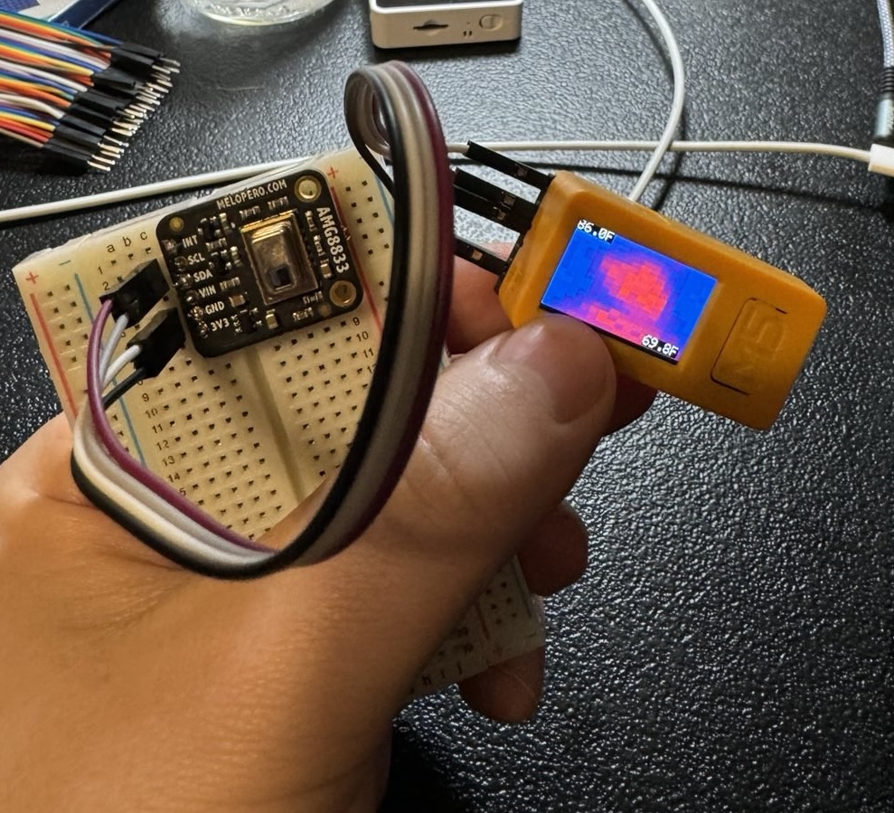
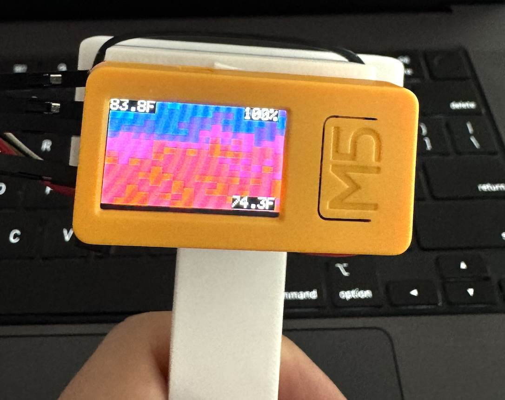
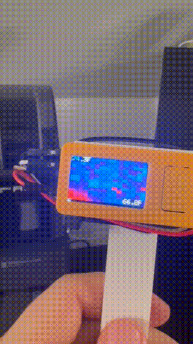
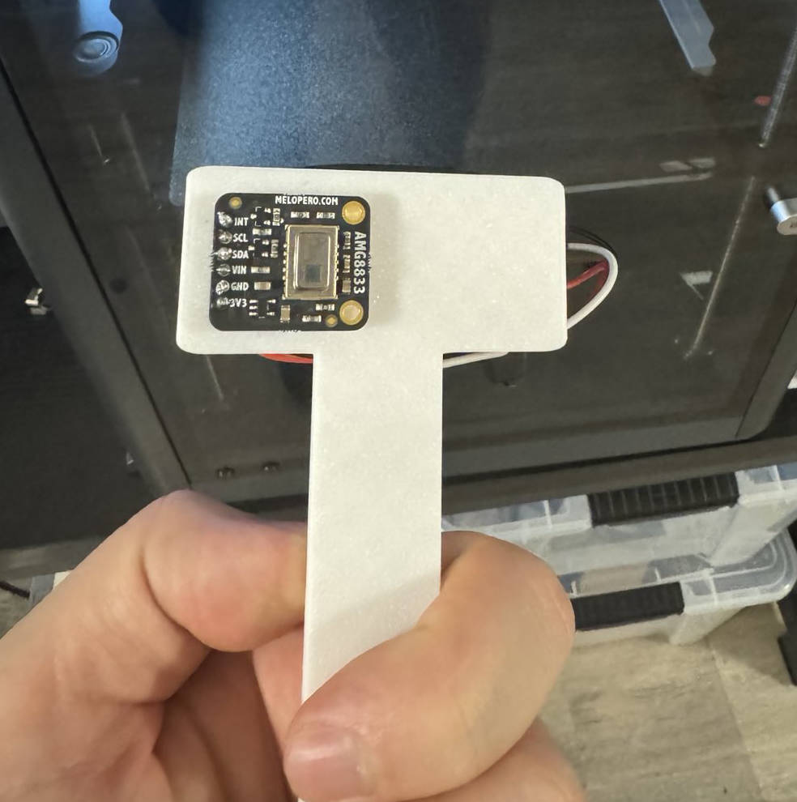
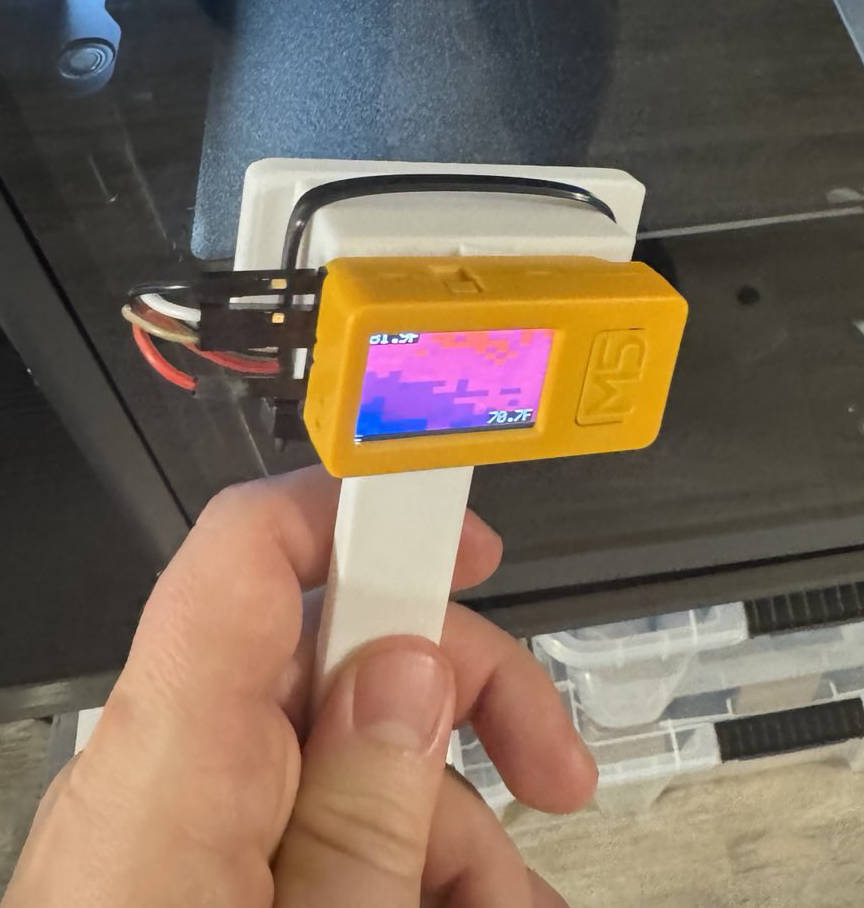

# M5StickCPlus2 AMG8833 Thermal Camera

This project transforms the M5StickCPlus2 into a portable thermal camera using the AMG8833 infrared sensor. The device displays a thermal image on its screen, with auto-ranging colors to represent temperature differences. Additionally, it shows the highest and lowest temperatures in Fahrenheit. You can power off the device by pressing the large button, which also triggers a beep sound before shutting down.

## Version 2
I've added a battery percentage indicator, and a button to power off the device.

## Pics







## Features

- **Real-Time Thermal Imaging**: Displays real-time thermal data using the AMG8833 sensor.
- **Auto-Ranging Colors**: Colors are automatically adjusted based on the temperature range detected.
- **Temperature Display**: Shows the highest and lowest temperatures in Fahrenheit on the screen.
- **Button Interaction**: Pressing the large button triggers a beep and powers off the device.

## Pinout

Below is the pin configuration used to connect the AMG8833 sensor to the M5StickCPlus2:

  **AMG8833 Sensor Pin** | **M5StickCPlus2 Pin**
  ------------------------|-------------------------
  VCC                     | 3.3V
  GND                     | GND
  SDA                     | GPIO 25
  SCL                     | GPIO 26

### Notes:
- The I2C communication is configured on GPIO 25 (SDA) and GPIO 26 (SCL) for the M5StickCPlus2.

## Getting Started

### Prerequisites

- **M5StickCPlus2**
- **AMG8833 Infrared Thermal Camera Sensor**
- **Arduino IDE**
- **M5StickCPlus2 Library**
- **Adafruit AMG88xx Library**

### Easy Mode
Use M5 Burner and burn the this [M5StickCPlus2](m5stickcplus-2-ircam.v2.bin) to your M5StickCPlus2.

### Installation

1. **Clone the Repository:**
   ```bash
   git clone https://github.com/RamboRogers/M5StickCPlus2-AMG8833-Thermal-Camera.git
   cd M5StickCPlus2-AMG8833-Thermal-Camera
   ```

### Open the Sketch in Arduino IDE:
Open the iracam-basic.ino file in the Arduino IDE.

### Install Required Libraries:
Ensure the following libraries are installed:

M5StickCPlus2 (M5Unified)
Adafruit AMG88xx

### Upload the Sketch:
Connect your M5StickCPlus2 and upload the sketch via the Arduino IDE.

## Usage
Thermal Display: Once the device is powered on, it will display the thermal image in real-time.
Power Off: Press the large button to beep and power off the device.

## Mount or Hardware
I have used a 3D printed case to mount the device. The case is available in the [M5StickCplus2IrCamera.stl](M5StickCplus2IrCamera.stl) file in this repository.





## License
This project is licensed under the GPLv3 License - see the LICENSE file for details.

## Acknowledgments
- Developed by Matthew Rogers. For more projects and information, visit [matthewrogers.org](https://matthewrogers.org).
- Follow me on GitHub: [RamboRogers](https://github.com/RamboRogers).

## Contributing
Contributions are welcome! Please fork this repository and submit pull requests for any enhancements or bug fixes.

## Contact
For any inquiries, feel free to reach out via my website (https://matthewrogers.org) or GitHub.